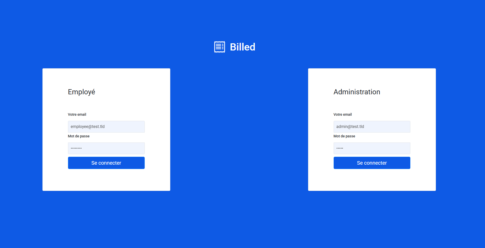
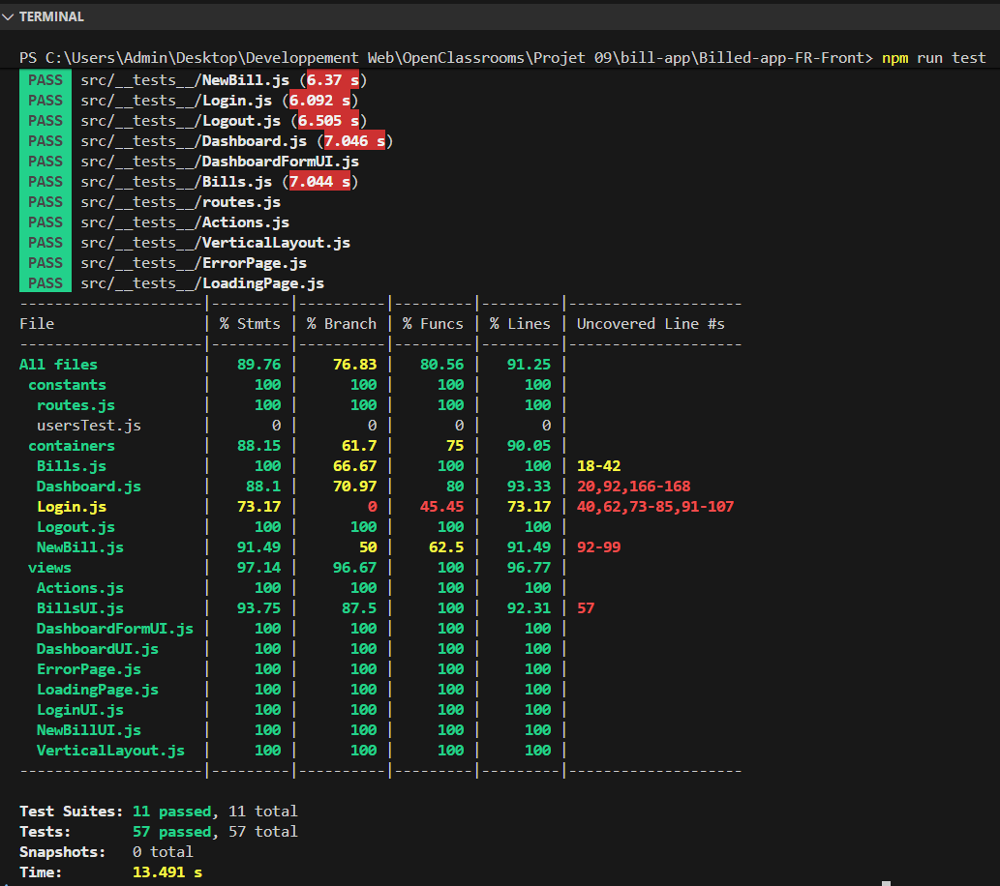
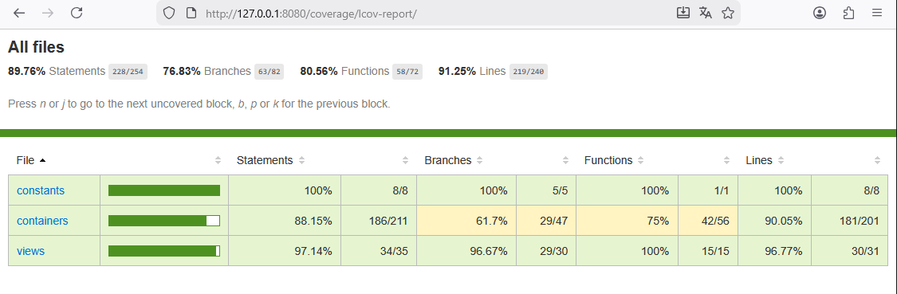

# Billed App - Frontend

Application de gestion de notes de frais - Projet 9 OpenClassrooms

## 📋 Description

Application SaaS permettant aux employés de soumettre des notes de frais et aux administrateurs RH de les valider.

#### Page de connexion



## 🎯 Travail réalisé

### Bugs corrigés
- **Bug #1** : Tri antichronologique des dates dans Bills.js
- **Bug #2** : Login administrateur (sélecteurs data-testid incorrects)
- **Bug #3** : Validation des formats de fichiers (jpg, jpeg, png uniquement)
- **Bug #4** : Ouverture simultanée de plusieurs listes dans le Dashboard
- **Bonus** : Correction de bugs querySelector avec backticks (Bills.js et NewBill.js)

### Tests ajoutés
- **Tests unitaires NewBill.js** : 5 tests (validation extensions + handleSubmit)
- **Tests d'intégration GET Bills.js** : 3 tests (succès, erreur 404, erreur 500)
- **Tests d'intégration POST NewBill.js** : 3 tests (upload fichier avec gestion erreurs)
- **Couverture globale** : 89.76% (objectif : 80% ✅)
- **Total** : 57 tests qui passent

### Résultats des tests

#### Tests Jest - 57 tests passent avec succès


#### Couverture globale - 89.76%



## 🛠️ Installation

### Prérequis
- Node.js v16 ou v18
- npm

### 1. Cloner le projet
```bash
git clone https://github.com/MTDev2024/Billed-App.git
cd Billed-App
```

### 2. Installer les dépendances
```bash
npm install
```

### 3. Installer live-server (si pas déjà installé)
```bash
npm install -g live-server
```

### 4. Lancer le backend (requis)

**Note :** Le backend doit tourner en parallèle.
```bash
# Dans un terminal séparé
git clone https://github.com/OpenClassrooms-Student-Center/Billed-app-FR-Back.git
cd Billed-app-FR-Back
npm install
npm run run:dev
```

Backend sur **http://localhost:5678**

### 5. Lancer le frontend
```bash
# Dans le dossier Billed-App
live-server
```

Frontend sur **http://127.0.0.1:8080/**

## 🧪 Tests

### Lancer tous les tests
```bash
npm run test
```

### Lancer un test spécifique
```bash
npm i -g jest-cli
jest src/__tests__/Bills.js
```

### Voir le rapport de couverture
```bash
npm run test
# Ouvrir : http://127.0.0.1:8080/coverage/lcov-report/
```

## 👤 Comptes de test

**Administrateur RH :**
- Email : `admin@test.tld`
- Password : `admin`

**Employé :**
- Email : `employee@test.tld`
- Password : `employee`

## 📚 Technologies

**Frontend :**
- HTML5, CSS3, JavaScript (ES6+)
- Jest, Testing Library
- Live-server

**Backend :**
- Node.js, Express, SQLite
- JWT (authentification)

**Outils :**
- Chrome DevTools (debugging)
- ESLint, Prettier
- Git, GitHub

## 🔗 Liens utiles

- [Backend repository](https://github.com/OpenClassrooms-Student-Center/Billed-app-FR-Back)
- [Frontend original](https://github.com/OpenClassrooms-Student-Center/Billed-app-FR-Front)

## 📝 Auteur

Projet réalisé dans le cadre de la formation Développeur Web d'OpenClassrooms.